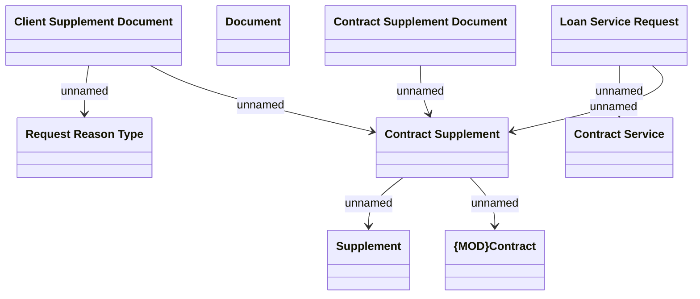

# Collection tool operation domains

```mermaid
classDiagram
    class Request_Reason_Type["Request Reason Type"]
    class Loan_Service_Request["Loan Service Request"]
    class Supplement["Supplement"]
    class Contract_Service["Contract Service"]
    class Document["Document"]
    class MOD_Contract["{MOD}Contract"]
    class Contract_Supplement["Contract Supplement"]
    class Client_Supplement_Document["Client Supplement Document"]
    class Contract_Supplement_Document["Contract Supplement Document"]
    Loan_Service_Request --> Contract_Service : unnamed
    Contract_Supplement_Document --> Contract_Supplement : unnamed
    Client_Supplement_Document --> Request_Reason_Type : unnamed
    Client_Supplement_Document --> Contract_Supplement : unnamed
    Contract_Supplement --> Supplement : unnamed
    Loan_Service_Request --> Contract_Supplement : unnamed
    Contract_Supplement --> MOD_Contract : unnamed
```
