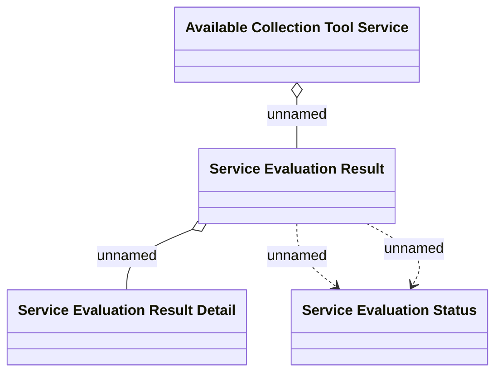

# Collection tools evaluation domains

- **Diagram Type**: Logical
- **Package**: HomerSelect/BSL/Analysis Model/Contract Management/Loan Service Processing/Collection tools support/Collection tools requests/Logical Data Model
- **Diagram ID**: 85502
- **Elements**: 4
- **Connectors**: 4

