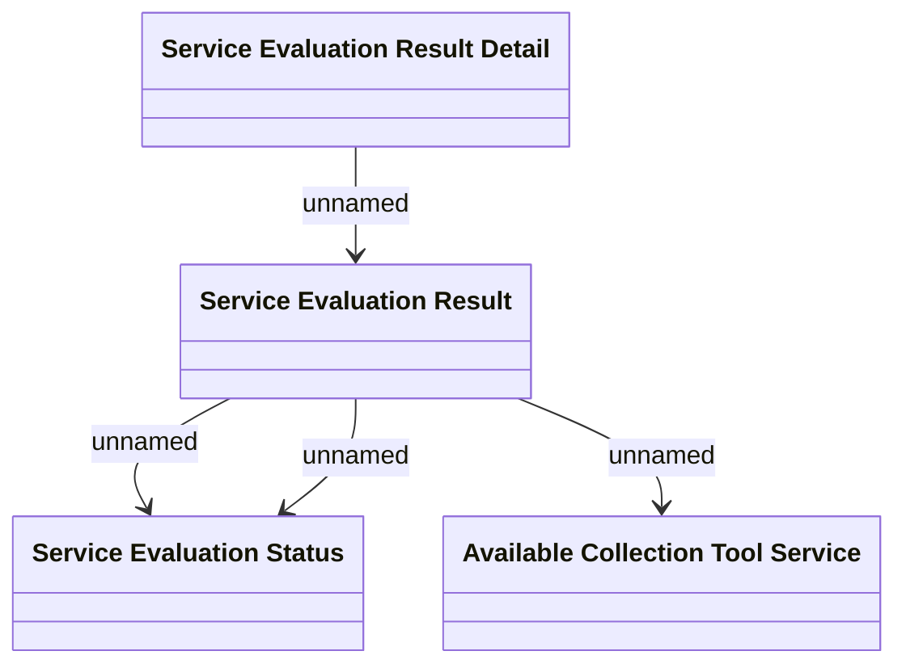

# Collection tools evaluation domains

```mermaid
classDiagram
    class Service_Evaluation_Result_Detail["Service Evaluation Result Detail"]
    class Available_Collection_Tool_Service["Available Collection Tool Service"]
    class Service_Evaluation_Status["Service Evaluation Status"]
    class Service_Evaluation_Result["Service Evaluation Result"]
    Service_Evaluation_Result_Detail --> Service_Evaluation_Result : unnamed
    Service_Evaluation_Result --> Service_Evaluation_Status : unnamed
    Service_Evaluation_Result --> Service_Evaluation_Status : unnamed
    Service_Evaluation_Result --> Available_Collection_Tool_Service : unnamed
```
