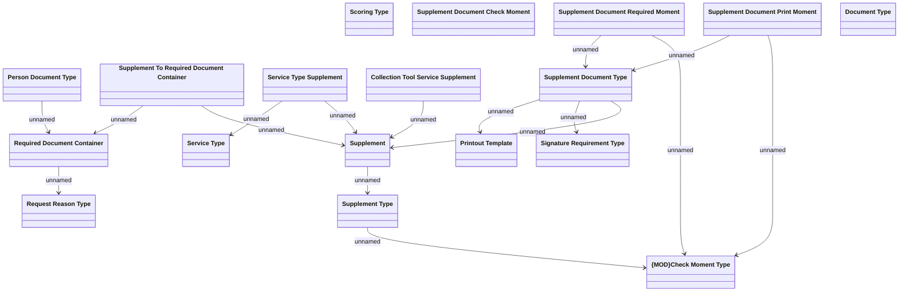

# Supplement definition for Collection tool service

```mermaid
classDiagram
    class Scoring_Type["Scoring Type"]
    class Service_Type["Service Type"]
    class Signature_Requirement_Type["Signature Requirement Type"]
    class Person_Document_Type["Person Document Type"]
    class Supplement_To_Required_Document_Container["Supplement To Required Document Container"]
    class Request_Reason_Type["Request Reason Type"]
    class Required_Document_Container["Required Document Container"]
    class Service_Type_Supplement["Service Type Supplement"]
    class Collection_Tool_Service_Supplement["Collection Tool Service Supplement"]
    class Supplement_Type["Supplement Type"]
    class Supplement_Document_Check_Moment["Supplement Document Check Moment"]
    class Supplement_Document_Required_Moment["Supplement Document Required Moment"]
    class Supplement_Document_Print_Moment["Supplement Document Print Moment"]
    class Printout_Template["Printout Template"]
    class Document_Type["Document Type"]
    class MOD_Check_Moment_Type["{MOD}Check Moment Type"]
    class Supplement_Document_Type["Supplement Document Type"]
    class Supplement["Supplement"]
    Required_Document_Container --> Request_Reason_Type : unnamed
    Person_Document_Type --> Required_Document_Container : unnamed
    Supplement_To_Required_Document_Container --> Required_Document_Container : unnamed
    Service_Type_Supplement --> Service_Type : unnamed
    Service_Type_Supplement --> Supplement : unnamed
    Collection_Tool_Service_Supplement --> Supplement : unnamed
    Supplement_Document_Required_Moment --> Supplement_Document_Type : unnamed
    Supplement_Document_Required_Moment --> MOD_Check_Moment_Type : unnamed
    Supplement_Document_Print_Moment --> Supplement_Document_Type : unnamed
    Supplement_Document_Type --> Printout_Template : unnamed
    Supplement_Document_Type --> Signature_Requirement_Type : unnamed
    Supplement_Document_Type --> Supplement : unnamed
    Supplement_To_Required_Document_Container --> Supplement : unnamed
    Supplement_Document_Print_Moment --> MOD_Check_Moment_Type : unnamed
    Supplement --> Supplement_Type : unnamed
    Supplement_Type --> MOD_Check_Moment_Type : unnamed
```
