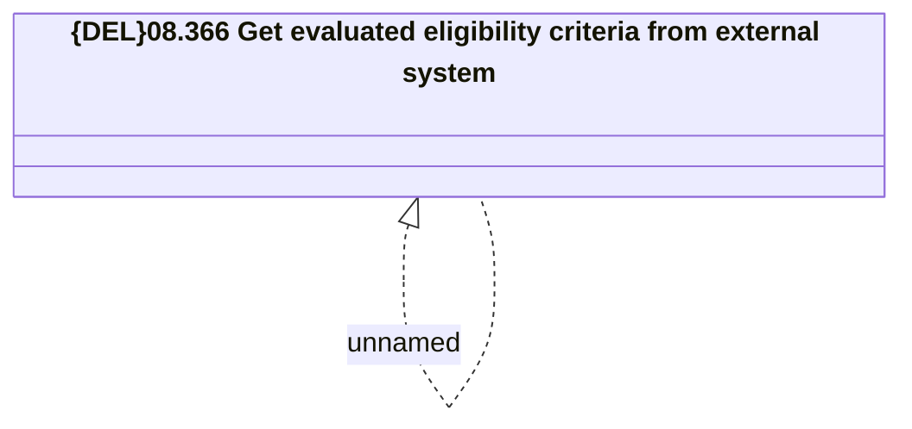

# Access Rigths

- **Diagram Type**: Logical
- **Package**: HomerSelect/BSL/Analysis Model/Contract Management/Loan Service Processing/Collection tools support/Service Eligibility Evaluation/Access Rigths
- **Diagram ID**: 158749
- **Elements**: 2
- **Connectors**: 1

