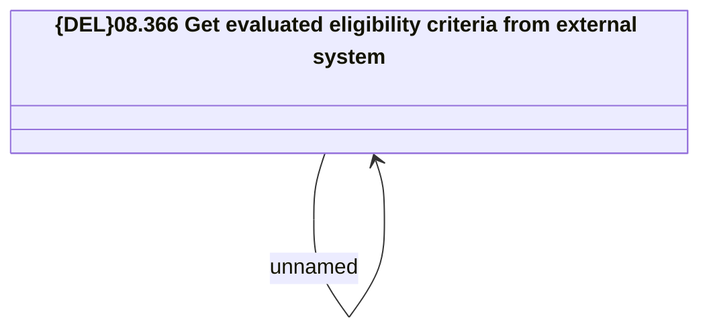

# Access Rigths

```mermaid
classDiagram
    class DEL_08_366_Get_evaluated_eligibility_criteria_from_external_["{DEL}08.366 Get evaluated eligibility criteria from external system"]
    class DEL_08_366_Get_evaluated_eligibility_criteria_from_external_["{DEL}08.366 Get evaluated eligibility criteria from external system"]
    DEL_08_366_Get_evaluated_eligibility_criteria_from_external_ --> DEL_08_366_Get_evaluated_eligibility_criteria_from_external_ : unnamed
```
