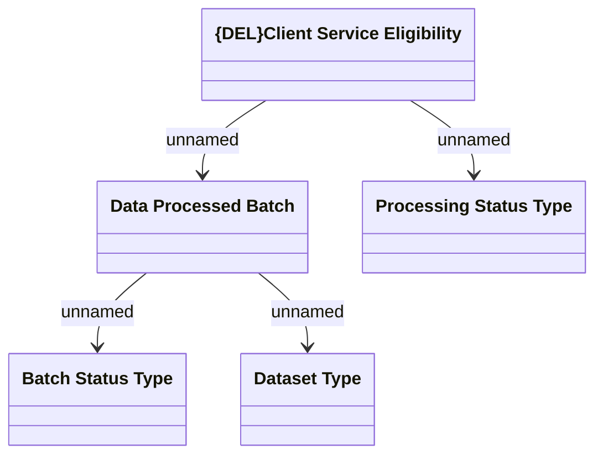

# Service eligibility evaluation from external system

```mermaid
classDiagram
    class Dataset_Type["Dataset Type"]
    class Batch_Status_Type["Batch Status Type"]
    class Data_Processed_Batch["Data Processed Batch"]
    class Processing_Status_Type["Processing Status Type"]
    class DEL_Client_Service_Eligibility["{DEL}Client Service Eligibility"]
    DEL_Client_Service_Eligibility --> Processing_Status_Type : unnamed
    DEL_Client_Service_Eligibility --> Data_Processed_Batch : unnamed
    Data_Processed_Batch --> Batch_Status_Type : unnamed
    Data_Processed_Batch --> Dataset_Type : unnamed
```
