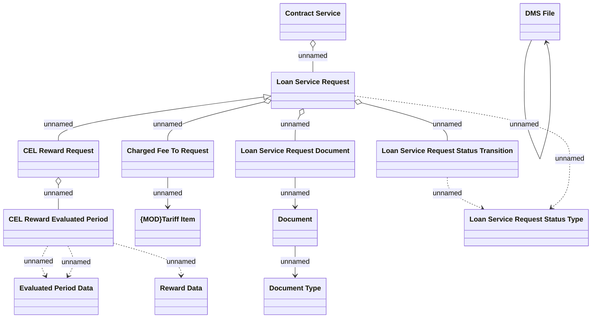

# CEL Rewards request

- **Diagram Type**: Logical
- **Package**: HomerSelect/BSL/Analysis Model/Contract Management/Loan Service Processing/Loan Option CEL/CEL Rewards/Logical Data Model
- **Diagram ID**: 101826
- **Elements**: 14
- **Connectors**: 15

