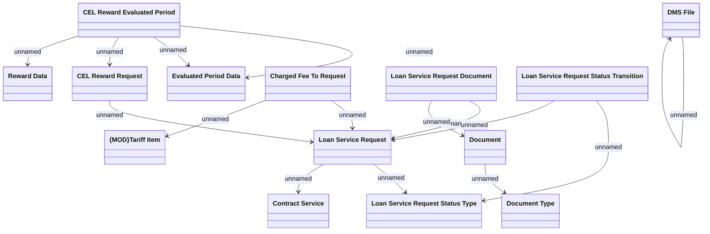

# CEL Rewards request

```mermaid
classDiagram
    class Reward_Data["Reward Data"]
    class Evaluated_Period_Data["Evaluated Period Data"]
    class CEL_Reward_Evaluated_Period["CEL Reward Evaluated Period"]
    class CEL_Reward_Request["CEL Reward Request"]
    class MOD_Tariff_Item["{MOD}Tariff Item"]
    class Charged_Fee_To_Request["Charged Fee To Request"]
    class Document["Document"]
    class Document_Type["Document Type"]
    class Loan_Service_Request_Document["Loan Service Request Document"]
    class DMS_File["DMS File"]
    class Loan_Service_Request_Status_Transition["Loan Service Request Status Transition"]
    class Loan_Service_Request_Status_Type["Loan Service Request Status Type"]
    class Loan_Service_Request["Loan Service Request"]
    class Contract_Service["Contract Service"]
    CEL_Reward_Evaluated_Period --> Evaluated_Period_Data : unnamed
    CEL_Reward_Evaluated_Period --> Evaluated_Period_Data : unnamed
    CEL_Reward_Evaluated_Period --> CEL_Reward_Request : unnamed
    CEL_Reward_Evaluated_Period --> Reward_Data : unnamed
    CEL_Reward_Request --> Loan_Service_Request : unnamed
    Loan_Service_Request_Status_Transition --> Loan_Service_Request_Status_Type : unnamed
    Loan_Service_Request --> Loan_Service_Request_Status_Type : unnamed
    Loan_Service_Request_Document --> Loan_Service_Request : unnamed
    Loan_Service_Request_Document --> Document : unnamed
    Charged_Fee_To_Request --> Loan_Service_Request : unnamed
    Loan_Service_Request --> Contract_Service : unnamed
    Loan_Service_Request_Status_Transition --> Loan_Service_Request : unnamed
    Charged_Fee_To_Request --> MOD_Tariff_Item : unnamed
    Document --> Document_Type : unnamed
    DMS_File --> DMS_File : unnamed
```
