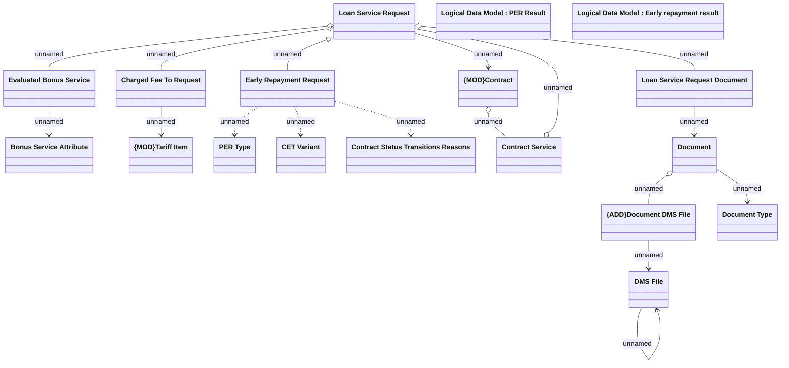

# Early repayment request

- **Diagram Type**: Logical
- **Package**: HomerSelect/BSL/Analysis Model/Contract Management/Loan Service Processing/Loan Option CEL/COMMON for Early Repayment/Logical Data Model
- **Diagram ID**: 163960
- **Elements**: 18
- **Connectors**: 17

