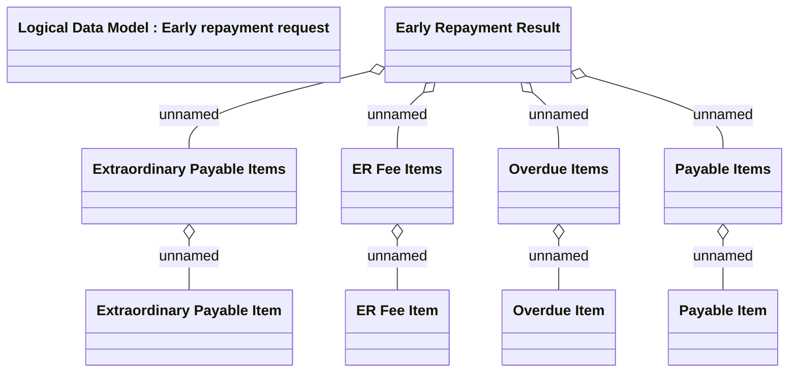

# Early repayment result

- **Diagram Type**: Logical
- **Package**: HomerSelect/BSL/Analysis Model/Contract Management/Loan Service Processing/Loan Option CEL/COMMON for Early Repayment/Logical Data Model
- **Diagram ID**: 163961
- **Elements**: 10
- **Connectors**: 8

