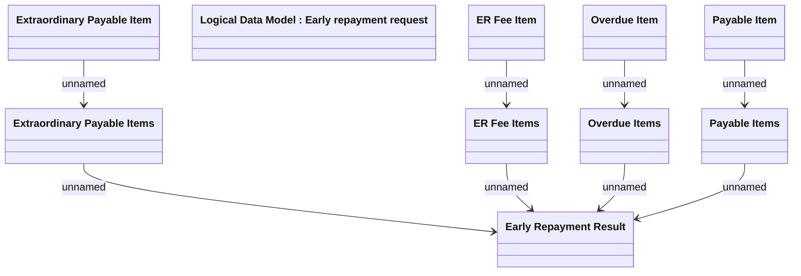

# Early repayment result

```mermaid
classDiagram
    class Extraordinary_Payable_Item["Extraordinary Payable Item"]
    class Extraordinary_Payable_Items["Extraordinary Payable Items"]
    class Logical_Data_Model_Early_repayment_request["Logical Data Model : Early repayment request"]
    class ER_Fee_Item["ER Fee Item"]
    class ER_Fee_Items["ER Fee Items"]
    class Overdue_Items["Overdue Items"]
    class Payable_Items["Payable Items"]
    class Overdue_Item["Overdue Item"]
    class Payable_Item["Payable Item"]
    class Early_Repayment_Result["Early Repayment Result"]
    Extraordinary_Payable_Items --> Early_Repayment_Result : unnamed
    ER_Fee_Items --> Early_Repayment_Result : unnamed
    Overdue_Items --> Early_Repayment_Result : unnamed
    Payable_Items --> Early_Repayment_Result : unnamed
    Payable_Item --> Payable_Items : unnamed
    Overdue_Item --> Overdue_Items : unnamed
    ER_Fee_Item --> ER_Fee_Items : unnamed
    Extraordinary_Payable_Item --> Extraordinary_Payable_Items : unnamed
```
