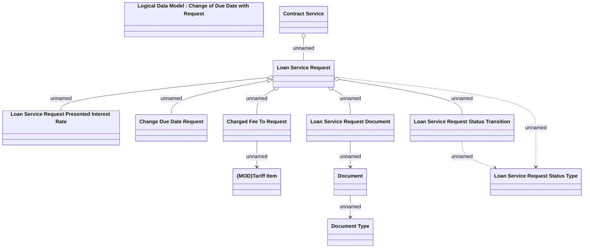

# Change due date request

- **Diagram Type**: Logical
- **Package**: HomerSelect/BSL/Analysis Model/Contract Management/Loan Service Processing/Loan Option CEL/Change of Due Date on request/Logical Data Model
- **Diagram ID**: 100082
- **Elements**: 12
- **Connectors**: 11

