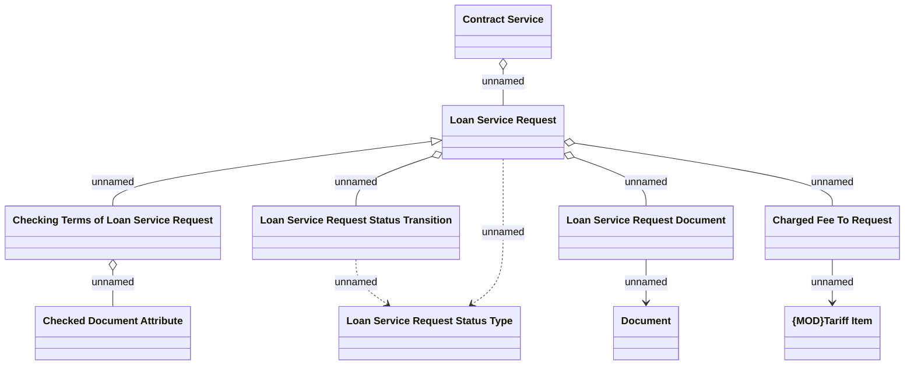

# Checking Terms of Loan Service Request

- **Diagram Type**: Logical
- **Package**: HomerSelect/BSL/Analysis Model/Contract Management/Loan Service Processing/Loan Option CEL/Checking Terms of Loan Service/Logical Data Model
- **Diagram ID**: 146236
- **Elements**: 10
- **Connectors**: 10

