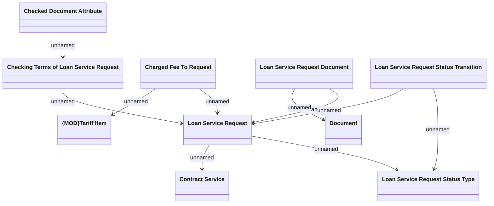

# Checking Terms of Loan Service Request

```mermaid
classDiagram
    class Checked_Document_Attribute["Checked Document Attribute"]
    class Checking_Terms_of_Loan_Service_Request["Checking Terms of Loan Service Request"]
    class MOD_Tariff_Item["{MOD}Tariff Item"]
    class Charged_Fee_To_Request["Charged Fee To Request"]
    class Document["Document"]
    class Loan_Service_Request_Document["Loan Service Request Document"]
    class Loan_Service_Request_Status_Transition["Loan Service Request Status Transition"]
    class Loan_Service_Request_Status_Type["Loan Service Request Status Type"]
    class Loan_Service_Request["Loan Service Request"]
    class Contract_Service["Contract Service"]
    Checking_Terms_of_Loan_Service_Request --> Loan_Service_Request : unnamed
    Checked_Document_Attribute --> Checking_Terms_of_Loan_Service_Request : unnamed
    Loan_Service_Request_Status_Transition --> Loan_Service_Request_Status_Type : unnamed
    Loan_Service_Request --> Loan_Service_Request_Status_Type : unnamed
    Loan_Service_Request_Document --> Loan_Service_Request : unnamed
    Loan_Service_Request_Document --> Document : unnamed
    Charged_Fee_To_Request --> Loan_Service_Request : unnamed
    Loan_Service_Request --> Contract_Service : unnamed
    Loan_Service_Request_Status_Transition --> Loan_Service_Request : unnamed
    Charged_Fee_To_Request --> MOD_Tariff_Item : unnamed
```
