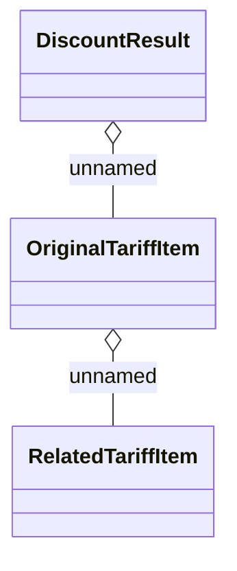

# DiscountResult structure

- **Diagram Type**: Logical
- **Package**: HomerSelect/BSL/Analysis Model/Contract Management/Loan Service Processing/Loan Option CEL/Fees-back/Logical Data Model
- **Diagram ID**: 70011
- **Elements**: 3
- **Connectors**: 2

