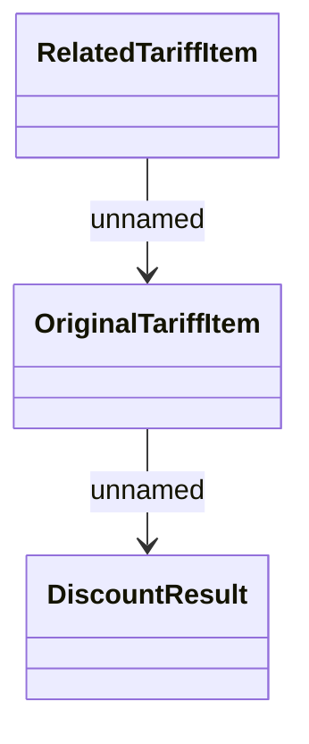

# DiscountResult structure

```mermaid
classDiagram
    class DiscountResult["DiscountResult"]
    class RelatedTariffItem["RelatedTariffItem"]
    class OriginalTariffItem["OriginalTariffItem"]
    OriginalTariffItem --> DiscountResult : unnamed
    RelatedTariffItem --> OriginalTariffItem : unnamed
```
