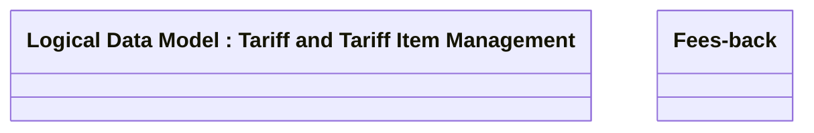

# FBACK Setting

- **Diagram Type**: Logical
- **Package**: HomerSelect/BSL/Analysis Model/Contract Management/Loan Service Processing/Loan Option CEL/Fees-back/Logical Data Model
- **Diagram ID**: 70012
- **Elements**: 2
- **Connectors**: 0

