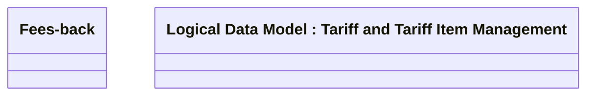

# FBACK Setting

```mermaid
classDiagram
    class Fees_back["Fees-back"]
    class Logical_Data_Model_Tariff_and_Tariff_Item_Management["Logical Data Model : Tariff and Tariff Item Management"]
```
