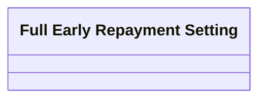

# FER Setting

- **Diagram Type**: Logical
- **Package**: HomerSelect/BSL/Analysis Model/Contract Management/Loan Service Processing/Loan Option CEL/Full Early Repayment/Logical Data Model
- **Diagram ID**: 117503
- **Elements**: 1
- **Connectors**: 0

