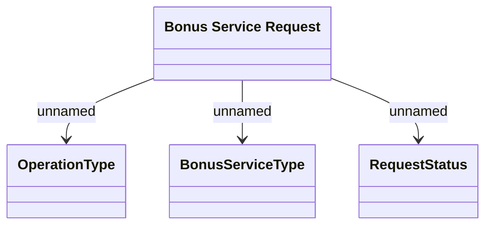

# Bonus service request

```mermaid
classDiagram
    class RequestStatus["RequestStatus"]
    class BonusServiceType["BonusServiceType"]
    class OperationType["OperationType"]
    class Bonus_Service_Request["Bonus Service Request"]
    Bonus_Service_Request --> OperationType : unnamed
    Bonus_Service_Request --> BonusServiceType : unnamed
    Bonus_Service_Request --> RequestStatus : unnamed
```
