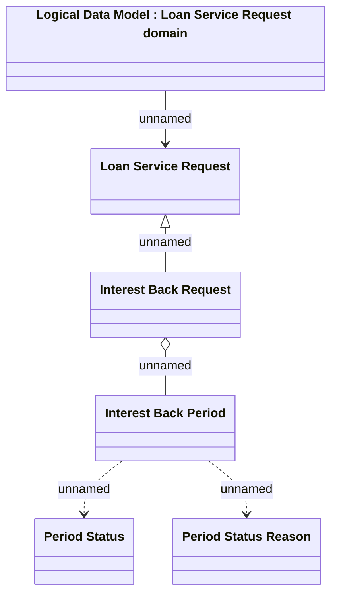

# Interest Back 

- **Diagram Type**: Logical
- **Package**: HomerSelect/BSL/Analysis Model/Contract Management/Loan Service Processing/Loan Option CEL/Interest Back/Logical Data Model
- **Diagram ID**: 163992
- **Elements**: 6
- **Connectors**: 5

