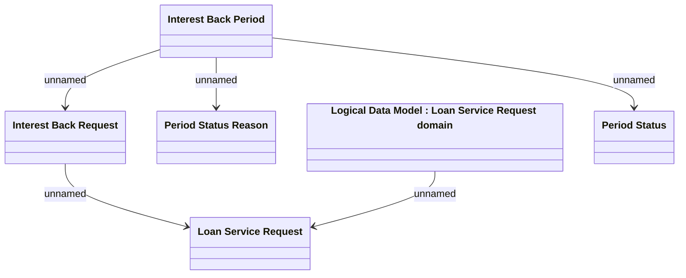

# Interest Back 

```mermaid
classDiagram
    class Interest_Back_Request["Interest Back Request"]
    class Period_Status_Reason["Period Status Reason"]
    class Logical_Data_Model_Loan_Service_Request_domain["Logical Data Model : Loan Service Request domain"]
    class Loan_Service_Request["Loan Service Request"]
    class Period_Status["Period Status"]
    class Interest_Back_Period["Interest Back Period"]
    Interest_Back_Period --> Period_Status : unnamed
    Interest_Back_Request --> Loan_Service_Request : unnamed
    Logical_Data_Model_Loan_Service_Request_domain --> Loan_Service_Request : unnamed
    Interest_Back_Period --> Period_Status_Reason : unnamed
    Interest_Back_Period --> Interest_Back_Request : unnamed
```
