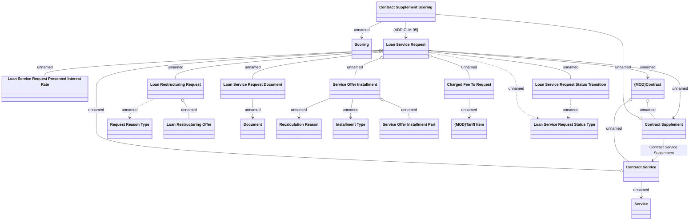

# Loan restructuring request domain

- **Diagram Type**: Logical
- **Package**: HomerSelect/BSL/Analysis Model/Contract Management/Loan Service Processing/Loan Option CEL/Loan Restructuring/Logical Data Model
- **Diagram ID**: 146243
- **Elements**: 21
- **Connectors**: 25

