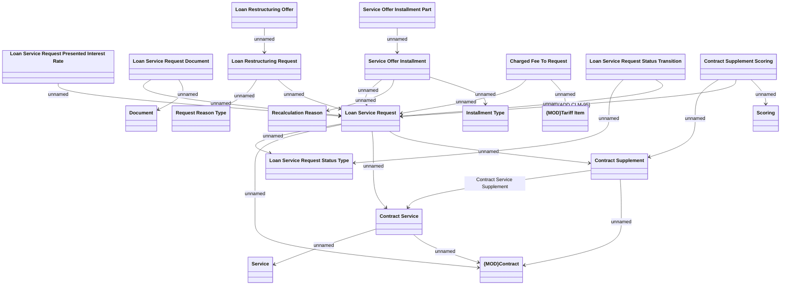

# Loan restructuring request domain

```mermaid
classDiagram
    class Scoring["Scoring"]
    class Loan_Service_Request_Presented_Interest_Rate["Loan Service Request Presented Interest Rate"]
    class Request_Reason_Type["Request Reason Type"]
    class Loan_Restructuring_Offer["Loan Restructuring Offer"]
    class Document["Document"]
    class Loan_Service_Request_Document["Loan Service Request Document"]
    class Loan_Restructuring_Request["Loan Restructuring Request"]
    class Recalculation_Reason["Recalculation Reason"]
    class Installment_Type["Installment Type"]
    class Service_Offer_Installment_Part["Service Offer Installment Part"]
    class Service_Offer_Installment["Service Offer Installment"]
    class MOD_Tariff_Item["{MOD}Tariff Item"]
    class Charged_Fee_To_Request["Charged Fee To Request"]
    class Loan_Service_Request_Status_Transition["Loan Service Request Status Transition"]
    class Loan_Service_Request_Status_Type["Loan Service Request Status Type"]
    class Service["Service"]
    class Loan_Service_Request["Loan Service Request"]
    class Contract_Service["Contract Service"]
    class MOD_Contract["{MOD}Contract"]
    class Contract_Supplement_Scoring["Contract Supplement Scoring"]
    class Contract_Supplement["Contract Supplement"]
    Loan_Restructuring_Request --> Request_Reason_Type : unnamed
    Loan_Restructuring_Offer --> Loan_Restructuring_Request : unnamed
    Loan_Restructuring_Request --> Loan_Service_Request : unnamed
    Loan_Service_Request_Status_Transition --> Loan_Service_Request_Status_Type : unnamed
    Loan_Service_Request --> Loan_Service_Request_Status_Type : unnamed
    Loan_Service_Request_Document --> Loan_Service_Request : unnamed
    Loan_Service_Request_Document --> Document : unnamed
    Service_Offer_Installment_Part --> Service_Offer_Installment : unnamed
    Charged_Fee_To_Request --> Loan_Service_Request : unnamed
    Loan_Service_Request --> MOD_Contract : unnamed
    Service_Offer_Installment --> Loan_Service_Request : unnamed
    Loan_Service_Request --> Contract_Service : unnamed
    Loan_Service_Request_Status_Transition --> Loan_Service_Request : unnamed
    Loan_Service_Request_Presented_Interest_Rate --> Loan_Service_Request : unnamed
    Charged_Fee_To_Request --> MOD_Tariff_Item : unnamed
    Contract_Service --> Service : unnamed
    Service_Offer_Installment --> Recalculation_Reason : unnamed
    Service_Offer_Installment --> Installment_Type : unnamed
    Contract_Supplement_Scoring --> Contract_Supplement : unnamed
    Contract_Supplement_Scoring --> Loan_Service_Request : {ADD CLM-95}
    Contract_Supplement_Scoring --> Scoring : unnamed
    Contract_Supplement --> Contract_Service : Contract Service Supplement
    Loan_Service_Request --> Contract_Supplement : unnamed
    Contract_Service --> MOD_Contract : unnamed
    Contract_Supplement --> MOD_Contract : unnamed
```
