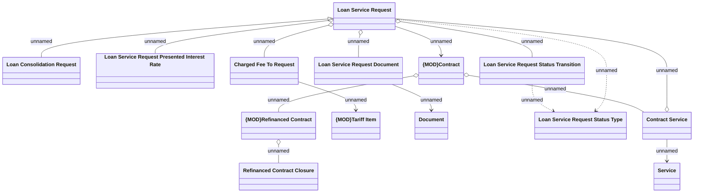

# Loan consolidation - Logical Data Model

- **Diagram Type**: Logical
- **Package**: HomerSelect/BSL/Analysis Model/Contract Management/Loan Service Processing/Loan Option CEL/Loan consolidation/Logical Data Model
- **Diagram ID**: 146241
- **Elements**: 14
- **Connectors**: 15

