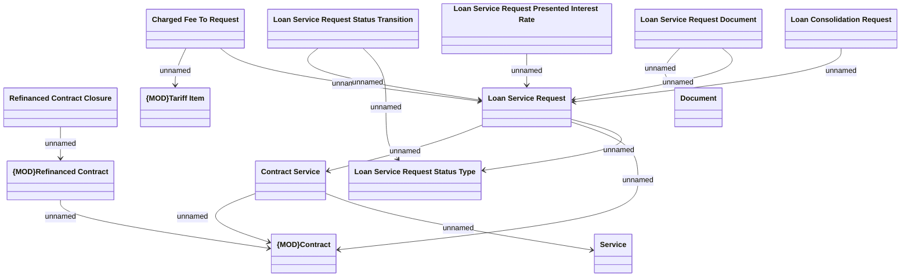

# Loan consolidation - Logical Data Model

```mermaid
classDiagram
    class Refinanced_Contract_Closure["Refinanced Contract Closure"]
    class MOD_Refinanced_Contract["{MOD}Refinanced Contract "]
    class Loan_Consolidation_Request["Loan Consolidation Request"]
    class MOD_Tariff_Item["{MOD}Tariff Item"]
    class Service["Service"]
    class Loan_Service_Request_Presented_Interest_Rate["Loan Service Request Presented Interest Rate"]
    class Document["Document"]
    class Loan_Service_Request_Document["Loan Service Request Document"]
    class Charged_Fee_To_Request["Charged Fee To Request"]
    class Loan_Service_Request_Status_Transition["Loan Service Request Status Transition"]
    class Loan_Service_Request_Status_Type["Loan Service Request Status Type"]
    class Loan_Service_Request["Loan Service Request"]
    class Contract_Service["Contract Service"]
    class MOD_Contract["{MOD}Contract"]
    Loan_Consolidation_Request --> Loan_Service_Request : unnamed
    Loan_Service_Request_Status_Transition --> Loan_Service_Request_Status_Type : unnamed
    Loan_Service_Request --> Loan_Service_Request_Status_Type : unnamed
    Loan_Service_Request_Document --> Loan_Service_Request : unnamed
    Loan_Service_Request_Document --> Document : unnamed
    Charged_Fee_To_Request --> Loan_Service_Request : unnamed
    Loan_Service_Request --> MOD_Contract : unnamed
    Loan_Service_Request --> Contract_Service : unnamed
    Loan_Service_Request_Status_Transition --> Loan_Service_Request : unnamed
    Loan_Service_Request_Presented_Interest_Rate --> Loan_Service_Request : unnamed
    Charged_Fee_To_Request --> MOD_Tariff_Item : unnamed
    Contract_Service --> Service : unnamed
    MOD_Refinanced_Contract --> MOD_Contract : unnamed
    Refinanced_Contract_Closure --> MOD_Refinanced_Contract : unnamed
    Contract_Service --> MOD_Contract : unnamed
```
