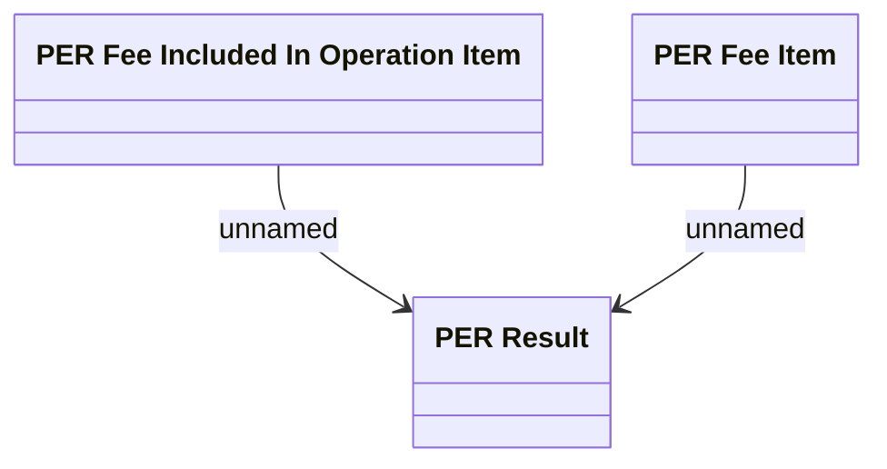

# PER Result

```mermaid
classDiagram
    class PER_Fee_Included_In_Operation_Item["PER Fee Included In Operation Item"]
    class PER_Fee_Item["PER Fee Item"]
    class PER_Result["PER Result"]
    PER_Fee_Included_In_Operation_Item --> PER_Result : unnamed
    PER_Fee_Item --> PER_Result : unnamed
```
