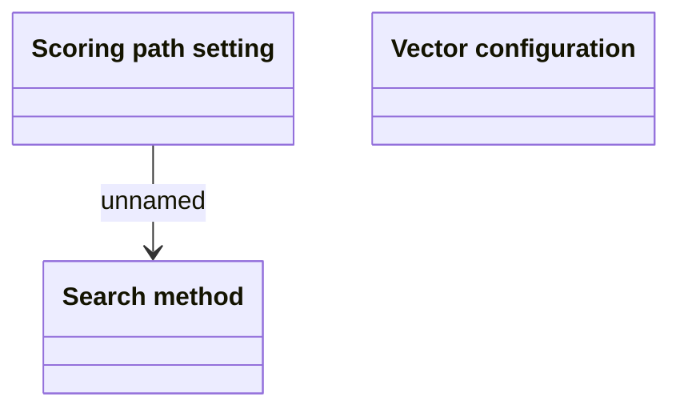

# Vector configuration

```mermaid
classDiagram
    class Search_method["Search method"]
    class Scoring_path_setting["Scoring path setting"]
    class Vector_configuration["Vector configuration"]
    Scoring_path_setting --> Search_method : unnamed
```
