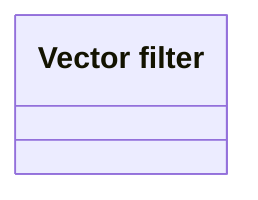

# Vector filters

- **Diagram Type**: Logical
- **Package**: HomerSelect/BSL/Analysis Model/Contract Origination/Application Evaluation/Logical Data Model
- **Diagram ID**: 153565
- **Elements**: 1
- **Connectors**: 0

