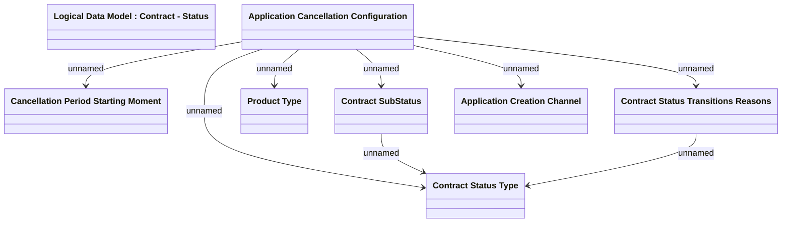

# Application Cancellation Configuration

```mermaid
classDiagram
    class Cancellation_Period_Starting_Moment["Cancellation Period Starting Moment"]
    class Logical_Data_Model_Contract_Status["Logical Data Model : Contract - Status"]
    class Contract_SubStatus["Contract SubStatus"]
    class Contract_Status_Type["Contract Status Type"]
    class Product_Type["Product Type"]
    class Application_Cancellation_Configuration["Application Cancellation Configuration"]
    class Contract_Status_Transitions_Reasons["Contract Status Transitions Reasons"]
    class Application_Creation_Channel["Application Creation Channel"]
    Application_Cancellation_Configuration --> Application_Creation_Channel : unnamed
    Application_Cancellation_Configuration --> Contract_Status_Transitions_Reasons : unnamed
    Application_Cancellation_Configuration --> Product_Type : unnamed
    Application_Cancellation_Configuration --> Contract_Status_Type : unnamed
    Application_Cancellation_Configuration --> Contract_SubStatus : unnamed
    Application_Cancellation_Configuration --> Cancellation_Period_Starting_Moment : unnamed
    Contract_SubStatus --> Contract_Status_Type : unnamed
    Contract_Status_Transitions_Reasons --> Contract_Status_Type : unnamed
```
