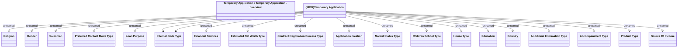

# Temporary Application - Attributes, Types and Enumerations

```mermaid
classDiagram
    class Estimated_Net_Worth_Type["Estimated Net Worth Type"]
    class Gender["Gender"]
    class Salesman["Salesman"]
    class Preferred_Contact_Mode_Type["Preferred Contact Mode Type"]
    class Loan_Purpose["Loan Purpose"]
    class Internal_Code_Type["Internal Code Type"]
    class Financial_Services["Financial Services"]
    class Source_Of_Income["Source Of Income"]
    class Contract_Negotiation_Process_Type["Contract Negotiation Process Type"]
    class Religion["Religion"]
    class Marital_Status_Type["Marital Status Type"]
    class Children_School_Type["Children School Type"]
    class House_Type["House Type"]
    class Education["Education"]
    class Country["Country"]
    class Additional_Information_Type["Additional Information Type"]
    class Accompaniment_Type["Accompaniment Type"]
    class Product_Type["Product Type"]
    class Temporary_Application_Temporary_Application_overview["Temporary Application : Temporary Application - overview"]
    class Application_creation["Application creation"]
    class MOD_Temporary_Application["{MOD}Temporary Application"]
    MOD_Temporary_Application --> Religion : unnamed
    MOD_Temporary_Application --> Gender : unnamed
    MOD_Temporary_Application --> Salesman : unnamed
    MOD_Temporary_Application --> Preferred_Contact_Mode_Type : unnamed
    MOD_Temporary_Application --> Loan_Purpose : unnamed
    MOD_Temporary_Application --> Internal_Code_Type : unnamed
    MOD_Temporary_Application --> Internal_Code_Type : unnamed
    MOD_Temporary_Application --> Financial_Services : unnamed
    MOD_Temporary_Application --> Estimated_Net_Worth_Type : unnamed
    MOD_Temporary_Application --> Contract_Negotiation_Process_Type : unnamed
    MOD_Temporary_Application --> Application_creation : unnamed
    MOD_Temporary_Application --> Marital_Status_Type : unnamed
    MOD_Temporary_Application --> Children_School_Type : unnamed
    MOD_Temporary_Application --> House_Type : unnamed
    MOD_Temporary_Application --> Education : unnamed
    MOD_Temporary_Application --> Country : unnamed
    MOD_Temporary_Application --> Additional_Information_Type : unnamed
    MOD_Temporary_Application --> Accompaniment_Type : unnamed
    MOD_Temporary_Application --> Product_Type : unnamed
    MOD_Temporary_Application --> Source_Of_Income : unnamed
```
