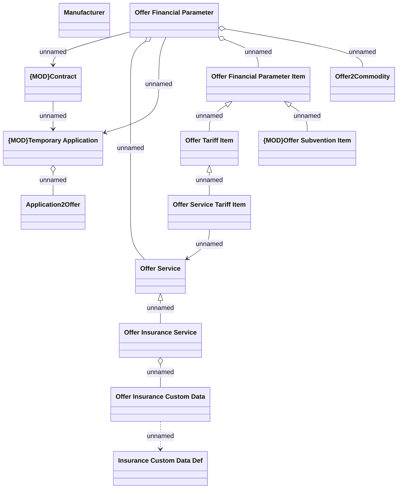

# Temporary Application - Financial Parameters

- **Diagram Type**: Logical
- **Package**: HomerSelect/BSL/Analysis Model/Contract Origination/COMMON for Contract origination/Logical Data Model
- **Diagram ID**: 153598
- **Elements**: 14
- **Connectors**: 14

