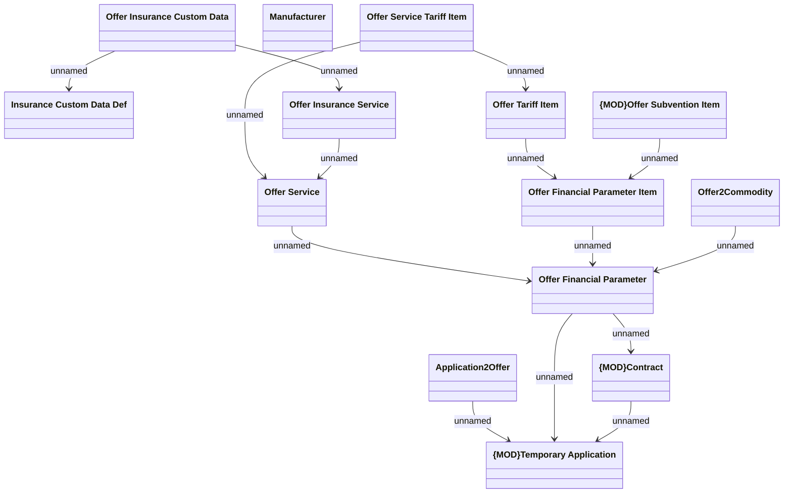

# Temporary Application - Financial Parameters

```mermaid
classDiagram
    class Offer2Commodity["Offer2Commodity"]
    class Application2Offer["Application2Offer"]
    class Insurance_Custom_Data_Def["Insurance Custom Data Def"]
    class Offer_Insurance_Custom_Data["Offer Insurance Custom Data"]
    class Manufacturer["Manufacturer"]
    class Offer_Insurance_Service["Offer Insurance Service"]
    class Offer_Service_Tariff_Item["Offer Service Tariff Item"]
    class Offer_Service["Offer Service"]
    class MOD_Offer_Subvention_Item["{MOD}Offer Subvention Item"]
    class Offer_Tariff_Item["Offer Tariff Item"]
    class Offer_Financial_Parameter_Item["Offer Financial Parameter Item"]
    class Offer_Financial_Parameter["Offer Financial Parameter"]
    class MOD_Temporary_Application["{MOD}Temporary Application"]
    class MOD_Contract["{MOD}Contract"]
    Application2Offer --> MOD_Temporary_Application : unnamed
    Offer_Tariff_Item --> Offer_Financial_Parameter_Item : unnamed
    Offer_Service_Tariff_Item --> Offer_Tariff_Item : unnamed
    Offer_Service_Tariff_Item --> Offer_Service : unnamed
    Offer_Insurance_Custom_Data --> Offer_Insurance_Service : unnamed
    Offer_Insurance_Service --> Offer_Service : unnamed
    Offer_Insurance_Custom_Data --> Insurance_Custom_Data_Def : unnamed
    Offer_Financial_Parameter --> MOD_Contract : unnamed
    Offer_Service --> Offer_Financial_Parameter : unnamed
    Offer_Financial_Parameter --> MOD_Temporary_Application : unnamed
    Offer_Financial_Parameter_Item --> Offer_Financial_Parameter : unnamed
    MOD_Offer_Subvention_Item --> Offer_Financial_Parameter_Item : unnamed
    MOD_Contract --> MOD_Temporary_Application : unnamed
    Offer2Commodity --> Offer_Financial_Parameter : unnamed
```
