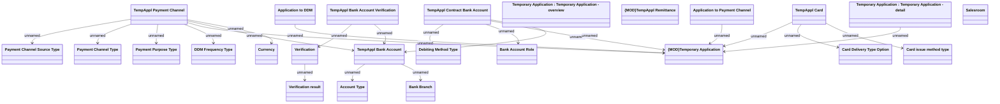

# Temporary Application - Payment Information

```mermaid
classDiagram
    class DDM_Frequency_Type["DDM Frequency Type"]
    class Payment_Channel_Source_Type["Payment Channel Source Type"]
    class Application_to_DDM["Application to DDM"]
    class Application_to_Payment_Channel["Application to Payment Channel"]
    class TempAppl_Bank_Account_Verification["TempAppl Bank Account Verification"]
    class Verification_result["Verification result"]
    class Verification["Verification"]
    class Payment_Channel_Type["Payment Channel Type"]
    class Payment_Purpose_Type["Payment Purpose Type"]
    class Debiting_Method_Type["Debiting Method Type"]
    class Bank_Account_Role["Bank Account Role"]
    class Account_Type["Account Type"]
    class Currency["Currency"]
    class Temporary_Application_Temporary_Application_detail["Temporary Application : Temporary Application - detail"]
    class MOD_Temporary_Application["{MOD}Temporary Application"]
    class Temporary_Application_Temporary_Application_overview["Temporary Application : Temporary Application - overview"]
    class Card_Delivery_Type_Option["Card Delivery Type Option"]
    class MOD_TempAppl_Remittance["{MOD}TempAppl Remittance"]
    class Card_issue_method_type["Card issue method type"]
    class TempAppl_Card["TempAppl Card"]
    class TempAppl_Contract_Bank_Account["TempAppl Contract Bank Account"]
    class TempAppl_Bank_Account["TempAppl Bank Account"]
    class Bank_Branch["Bank Branch"]
    class TempAppl_Payment_Channel["TempAppl Payment Channel"]
    class Salesroom["Salesroom"]
    TempAppl_Card --> MOD_Temporary_Application : unnamed
    TempAppl_Payment_Channel --> Payment_Channel_Source_Type : unnamed
    Verification --> Verification_result : unnamed
    TempAppl_Bank_Account_Verification --> Verification : unnamed
    TempAppl_Payment_Channel --> Payment_Channel_Type : unnamed
    TempAppl_Payment_Channel --> Payment_Purpose_Type : unnamed
    TempAppl_Contract_Bank_Account --> Debiting_Method_Type : unnamed
    TempAppl_Contract_Bank_Account --> Bank_Account_Role : unnamed
    TempAppl_Bank_Account --> Account_Type : unnamed
    TempAppl_Payment_Channel --> DDM_Frequency_Type : unnamed
    Application_to_DDM --> MOD_Temporary_Application : unnamed
    TempAppl_Bank_Account --> Bank_Branch : unnamed
    TempAppl_Payment_Channel --> MOD_Temporary_Application : unnamed
    TempAppl_Contract_Bank_Account --> MOD_Temporary_Application : unnamed
    Application_to_Payment_Channel --> MOD_Temporary_Application : unnamed
    Temporary_Application_Temporary_Application_detail --> MOD_Temporary_Application : unnamed
    TempAppl_Card --> Card_Delivery_Type_Option : unnamed
    TempAppl_Card --> Card_issue_method_type : unnamed
    TempAppl_Contract_Bank_Account --> TempAppl_Bank_Account : unnamed
    TempAppl_Bank_Account_Verification --> TempAppl_Bank_Account : unnamed
    TempAppl_Payment_Channel --> TempAppl_Bank_Account : unnamed
    TempAppl_Payment_Channel --> Currency : unnamed
```
