# Temporary Application - Person and Employment

- **Diagram Type**: Logical
- **Package**: HomerSelect/BSL/Analysis Model/Contract Origination/COMMON for Contract origination/Logical Data Model
- **Diagram ID**: 153601
- **Elements**: 29
- **Connectors**: 35

```mermaid
classDiagram
    class TempAppl_Contact_Verification["TempAppl Contact Verification"]
    class TempAppl_Document_Verification["TempAppl Document Verification"]
    class Country["Country"]
    class Client_Address_Role["Client Address Role"]
    class Verification_result["Verification result"]
    class Gender["Gender"]
    class Person_Relation_Type["Person Relation Type"]
    class Contact_Type["Contact Type"]
    class Contact_Ownership_Type["Contact Ownership Type"]
    class Logical_Data_Model_Address_CORE["Logical Data Model : Address - CORE"]
    class Employment_Type["Employment Type"]
    class Salary_payment_method["Salary payment method"]
    class Profession["Profession"]
    class Economical_Status["Economical Status"]
    class Industry["Industry"]
    class Salary_frequency["Salary frequency"]
    class University_Course["University Course"]
    class Temporary_Application_Temporary_Application_overview["Temporary Application : Temporary Application - overview"]
    class Temporary_Application_Temporary_Application_detail["Temporary Application : Temporary Application - detail"]
    class MOD_TempAppl_Remittance["{MOD}TempAppl Remittance"]
    class TempAppl_Person_Address["TempAppl Person Address"]
    class Verification["Verification"]
    class TempAppl_Person["TempAppl Person"]
    class MOD_TempAppl_Employment["{MOD}TempAppl Employment"]
    class TempAppl_Document["TempAppl Document"]
    class TempAppl_Contact["TempAppl Contact"]
    class TempAppl_Client_Address["TempAppl Client Address"]
    class TempAppl_Address["TempAppl Address"]
    class MOD_Temporary_Application["{MOD}Temporary Application"]
    TempAppl_Contact ..> Contact_Type : unnamed
    TempAppl_Address ..> Country : unnamed
    MOD_TempAppl_Employment ..> Salary_frequency : unnamed
    MOD_TempAppl_Employment ..> Industry : unnamed
    MOD_TempAppl_Employment ..> Economical_Status : unnamed
    MOD_TempAppl_Employment ..> Profession : unnamed
    MOD_TempAppl_Employment ..> Salary_payment_method : unnamed
    TempAppl_Person_Address o-- TempAppl_Address : unnamed
    TempAppl_Contact ..> Contact_Ownership_Type : unnamed
    Verification <|-- TempAppl_Contact_Verification : unnamed
    TempAppl_Person ..> Person_Relation_Type : unnamed
    MOD_Temporary_Application ..> Gender : unnamed
    TempAppl_Person ..> Gender : unnamed
    Verification ..> Verification_result : unnamed
    TempAppl_Person_Address ..> Client_Address_Role : unnamed
    TempAppl_Client_Address ..> Client_Address_Role : unnamed
    MOD_TempAppl_Employment ..> Employment_Type : unnamed
    MOD_TempAppl_Employment o-- TempAppl_Address : unnamed
    MOD_Temporary_Application o-- TempAppl_Document : unnamed
    MOD_Temporary_Application o-- MOD_TempAppl_Employment : unnamed
    MOD_Temporary_Application o-- TempAppl_Client_Address : unnamed
    MOD_Temporary_Application o-- TempAppl_Person : unnamed
    MOD_Temporary_Application o-- TempAppl_Contact : unnamed
    TempAppl_Client_Address o-- TempAppl_Address : unnamed
    MOD_TempAppl_Employment ..> University_Course : unnamed
    TempAppl_Document o-- TempAppl_Document_Verification : unnamed
    Temporary_Application_Temporary_Application_detail --> MOD_Temporary_Application : unnamed
    MOD_TempAppl_Employment o-- TempAppl_Contact : unnamed
    TempAppl_Person o-- TempAppl_Document : unnamed
    TempAppl_Person o-- TempAppl_Contact : unnamed
    TempAppl_Person o-- TempAppl_Person_Address : unnamed
    TempAppl_Person o-- MOD_TempAppl_Employment : {DEL LOR-6643/}
    TempAppl_Person o-- MOD_TempAppl_Remittance : unnamed
    Verification <|-- TempAppl_Document_Verification : unnamed
    TempAppl_Contact o-- TempAppl_Contact_Verification : unnamed
```

