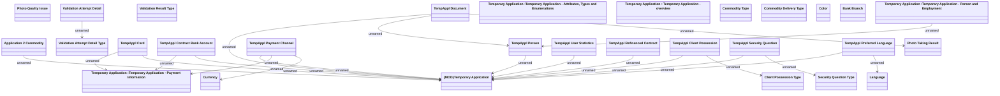

# Temporary Application - detail

```mermaid
classDiagram
    class Photo_Quality_Issue["Photo Quality Issue"]
    class Application_2_Commodity["Application 2 Commodity"]
    class Language["Language"]
    class Validation_Attempt_Detail_Type["Validation Attempt Detail Type"]
    class Client_Possession_Type["Client Possession Type"]
    class Validation_Attempt_Detail["Validation Attempt Detail"]
    class Security_Question_Type["Security Question Type"]
    class Currency["Currency"]
    class TempAppl_Card["TempAppl Card"]
    class Validation_Result_Type["Validation Result Type"]
    class TempAppl_Contract_Bank_Account["TempAppl Contract Bank Account"]
    class Photo_Taking_Result["Photo Taking Result"]
    class TempAppl_Payment_Channel["TempAppl Payment Channel"]
    class Temporary_Application_Temporary_Application_Person_and_Emplo["Temporary Application :Temporary Application - Person and Employment"]
    class TempAppl_Person["TempAppl Person"]
    class MOD_Temporary_Application["{MOD}Temporary Application"]
    class Temporary_Application_Temporary_Application_Payment_Informat["Temporary Application :Temporary Application - Payment Information"]
    class Temporary_Application_Temporary_Application_Attributes_Types["Temporary Application :Temporary Application - Attributes, Types and Enumerations"]
    class Temporary_Application_Temporary_Application_overview["Temporary Application : Temporary Application - overview"]
    class TempAppl_User_Statistics["TempAppl User Statistics"]
    class TempAppl_Refinanced_Contract["TempAppl Refinanced Contract "]
    class Commodity_Type["Commodity Type"]
    class TempAppl_Client_Possession["TempAppl Client Possession"]
    class Commodity_Delivery_Type["Commodity Delivery Type"]
    class TempAppl_Security_Question["TempAppl Security Question"]
    class Color["Color"]
    class TempAppl_Preferred_Language["TempAppl Preferred Language"]
    class Bank_Branch["Bank Branch"]
    class TempAppl_Document["TempAppl Document"]
    TempAppl_Contract_Bank_Account --> MOD_Temporary_Application : unnamed
    TempAppl_Client_Possession --> Client_Possession_Type : unnamed
    TempAppl_Security_Question --> Security_Question_Type : unnamed
    TempAppl_Payment_Channel --> Currency : unnamed
    TempAppl_Document --> Photo_Taking_Result : unnamed
    TempAppl_Document --> TempAppl_Person : unnamed
    Temporary_Application_Temporary_Application_Person_and_Emplo --> TempAppl_Person : unnamed
    TempAppl_Security_Question --> MOD_Temporary_Application : unnamed
    TempAppl_Preferred_Language --> Language : unnamed
    TempAppl_Card --> MOD_Temporary_Application : unnamed
    TempAppl_Payment_Channel --> Temporary_Application_Temporary_Application_Payment_Informat : unnamed
    TempAppl_Payment_Channel --> MOD_Temporary_Application : unnamed
    TempAppl_User_Statistics --> MOD_Temporary_Application : unnamed
    TempAppl_Person --> MOD_Temporary_Application : unnamed
    TempAppl_Client_Possession --> MOD_Temporary_Application : unnamed
    TempAppl_Preferred_Language --> MOD_Temporary_Application : unnamed
    Application_2_Commodity --> MOD_Temporary_Application : unnamed
    TempAppl_Refinanced_Contract --> MOD_Temporary_Application : unnamed
    TempAppl_Card --> Temporary_Application_Temporary_Application_Payment_Informat : unnamed
    TempAppl_Contract_Bank_Account --> Temporary_Application_Temporary_Application_Payment_Informat : unnamed
    TempAppl_Document --> MOD_Temporary_Application : unnamed
    Validation_Attempt_Detail --> Validation_Attempt_Detail_Type : unnamed
```
