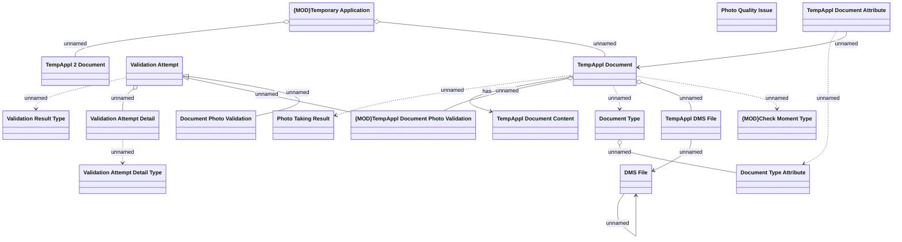

# Temporary Application - document

- **Diagram Type**: Logical
- **Package**: HomerSelect/BSL/Analysis Model/Contract Origination/COMMON for Contract origination/Logical Data Model
- **Diagram ID**: 153604
- **Elements**: 18
- **Connectors**: 18

