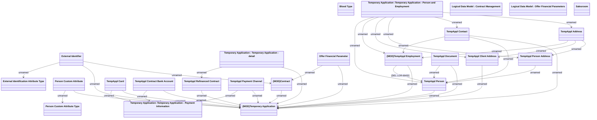

# Temporary Application - overview

```mermaid
classDiagram
    class Blood_Type["Blood Type"]
    class External_Identification_Attribute_Type["External Identification Attribute Type"]
    class External_Identifier["External Identifier"]
    class Person_Custom_Attribute_Type["Person Custom Attribute Type"]
    class Person_Custom_Attribute["Person Custom Attribute"]
    class Temporary_Application_Temporary_Application_Payment_Informat["Temporary Application :Temporary Application - Payment Information"]
    class Temporary_Application_Temporary_Application_detail["Temporary Application : Temporary Application - detail"]
    class Temporary_Application_Temporary_Application_Person_and_Emplo["Temporary Application :Temporary Application - Person and Employment"]
    class Logical_Data_Model_Contract_Management["Logical Data Model : Contract Management"]
    class Logical_Data_Model_Offer_Financial_Parameters["Logical Data Model : Offer Financial Parameters"]
    class Offer_Financial_Parameter["Offer Financial Parameter"]
    class TempAppl_Refinanced_Contract["TempAppl Refinanced Contract "]
    class TempAppl_Card["TempAppl Card"]
    class TempAppl_Contract_Bank_Account["TempAppl Contract Bank Account"]
    class TempAppl_Person_Address["TempAppl Person Address"]
    class TempAppl_Person["TempAppl Person"]
    class TempAppl_Payment_Channel["TempAppl Payment Channel"]
    class Salesroom["Salesroom"]
    class MOD_TempAppl_Employment["{MOD}TempAppl Employment"]
    class TempAppl_Document["TempAppl Document"]
    class TempAppl_Contact["TempAppl Contact"]
    class TempAppl_Client_Address["TempAppl Client Address"]
    class TempAppl_Address["TempAppl Address"]
    class MOD_Temporary_Application["{MOD}Temporary Application"]
    class MOD_Contract["{MOD}Contract"]
    Temporary_Application_Temporary_Application_Person_and_Emplo --> TempAppl_Person : unnamed
    External_Identifier --> External_Identification_Attribute_Type : unnamed
    Temporary_Application_Temporary_Application_Person_and_Emplo --> MOD_TempAppl_Employment : unnamed
    TempAppl_Address --> MOD_TempAppl_Employment : unnamed
    TempAppl_Contact --> MOD_TempAppl_Employment : unnamed
    TempAppl_Document --> TempAppl_Person : unnamed
    TempAppl_Person_Address --> TempAppl_Person : unnamed
    Temporary_Application_Temporary_Application_Person_and_Emplo --> TempAppl_Client_Address : unnamed
    MOD_TempAppl_Employment --> TempAppl_Person : {DEL LOR-6643/}
    TempAppl_Address --> TempAppl_Client_Address : unnamed
    TempAppl_Address --> TempAppl_Person_Address : unnamed
    Temporary_Application_Temporary_Application_Person_and_Emplo --> TempAppl_Person_Address : unnamed
    Temporary_Application_Temporary_Application_detail --> TempAppl_Refinanced_Contract : unnamed
    TempAppl_Payment_Channel --> Temporary_Application_Temporary_Application_Payment_Informat : unnamed
    TempAppl_Card --> Temporary_Application_Temporary_Application_Payment_Informat : unnamed
    TempAppl_Contract_Bank_Account --> Temporary_Application_Temporary_Application_Payment_Informat : unnamed
    Person_Custom_Attribute --> Person_Custom_Attribute_Type : unnamed
    TempAppl_Contact --> TempAppl_Person : unnamed
    TempAppl_Payment_Channel --> MOD_Temporary_Application : unnamed
    TempAppl_Person --> MOD_Temporary_Application : unnamed
    MOD_TempAppl_Employment --> MOD_Temporary_Application : unnamed
    TempAppl_Contract_Bank_Account --> MOD_Temporary_Application : unnamed
    TempAppl_Client_Address --> MOD_Temporary_Application : unnamed
    Temporary_Application_Temporary_Application_Person_and_Emplo --> TempAppl_Contact : unnamed
    External_Identifier --> MOD_Temporary_Application : unnamed
    TempAppl_Card --> MOD_Temporary_Application : unnamed
    TempAppl_Document --> MOD_Temporary_Application : unnamed
    Person_Custom_Attribute --> MOD_Temporary_Application : unnamed
    Temporary_Application_Temporary_Application_detail --> MOD_Temporary_Application : unnamed
    TempAppl_Contact --> MOD_Temporary_Application : unnamed
    Temporary_Application_Temporary_Application_Person_and_Emplo --> TempAppl_Address : unnamed
    TempAppl_Refinanced_Contract --> MOD_Temporary_Application : unnamed
    Offer_Financial_Parameter --> MOD_Contract : unnamed
    Offer_Financial_Parameter --> MOD_Temporary_Application : unnamed
    MOD_Contract --> MOD_Temporary_Application : unnamed
    External_Identifier --> MOD_Contract : unnamed
```
