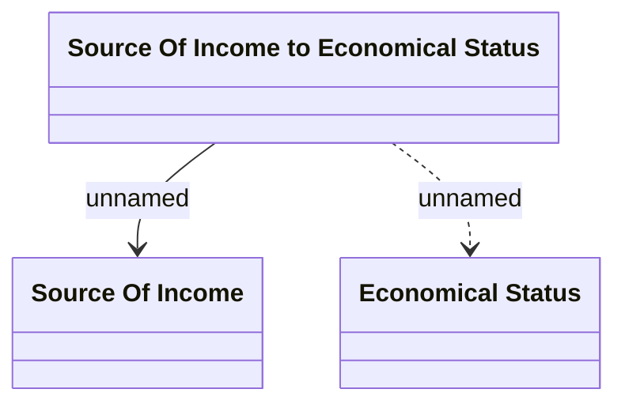

# Source of income and economical status relation

- **Diagram Type**: Logical
- **Package**: HomerSelect/BSL/Analysis Model/Contract Origination/COMMON for Contract origination/Logical Data Model/Enums&Types
- **Diagram ID**: 158520
- **Elements**: 3
- **Connectors**: 2

