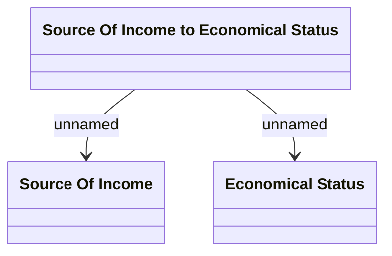

# Source of income and economical status relation

```mermaid
classDiagram
    class Economical_Status["Economical Status"]
    class Source_Of_Income["Source Of Income"]
    class Source_Of_Income_to_Economical_Status["Source Of Income to Economical Status"]
    Source_Of_Income_to_Economical_Status --> Source_Of_Income : unnamed
    Source_Of_Income_to_Economical_Status --> Economical_Status : unnamed
```
