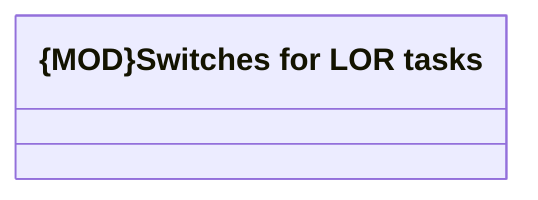

# Switches for LOR tasks

- **Diagram Type**: Logical
- **Package**: HomerSelect/BSL/Analysis Model/Contract Origination/COMMON for Contract origination/Switches for LOR tasks
- **Diagram ID**: 159113
- **Elements**: 1
- **Connectors**: 0

