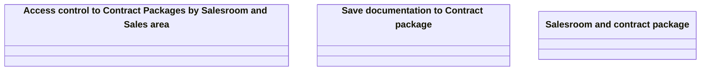

# Business Rules

- **Diagram Type**: Logical
- **Package**: HomerSelect/BSL/Analysis Model/Contract Origination/Contract package tracking/Business Rules
- **Diagram ID**: 98445
- **Elements**: 3
- **Connectors**: 0

