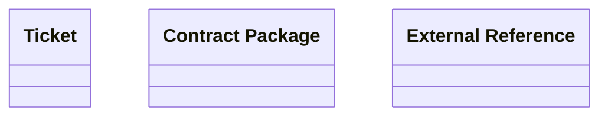

# Ticketing contract package mistakes

- **Diagram Type**: Logical
- **Package**: HomerSelect/BSL/Analysis Model/Contract Origination/Contract package tracking/Logical Data Model
- **Diagram ID**: 110079
- **Elements**: 3
- **Connectors**: 0

