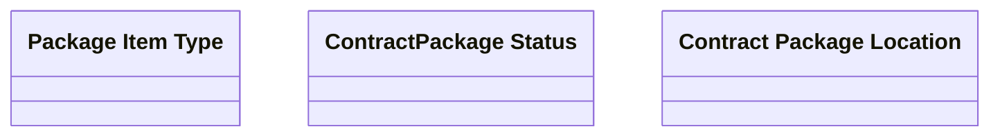

# Types

- **Diagram Type**: Logical
- **Package**: HomerSelect/BSL/Analysis Model/Contract Origination/Contract package tracking/Logical Data Model/Types
- **Diagram ID**: 63474
- **Elements**: 3
- **Connectors**: 0

