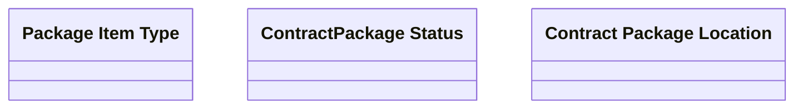

# Types

```mermaid
classDiagram
    class Package_Item_Type["Package Item Type"]
    class ContractPackage_Status["ContractPackage Status"]
    class Contract_Package_Location["Contract Package Location"]
```
