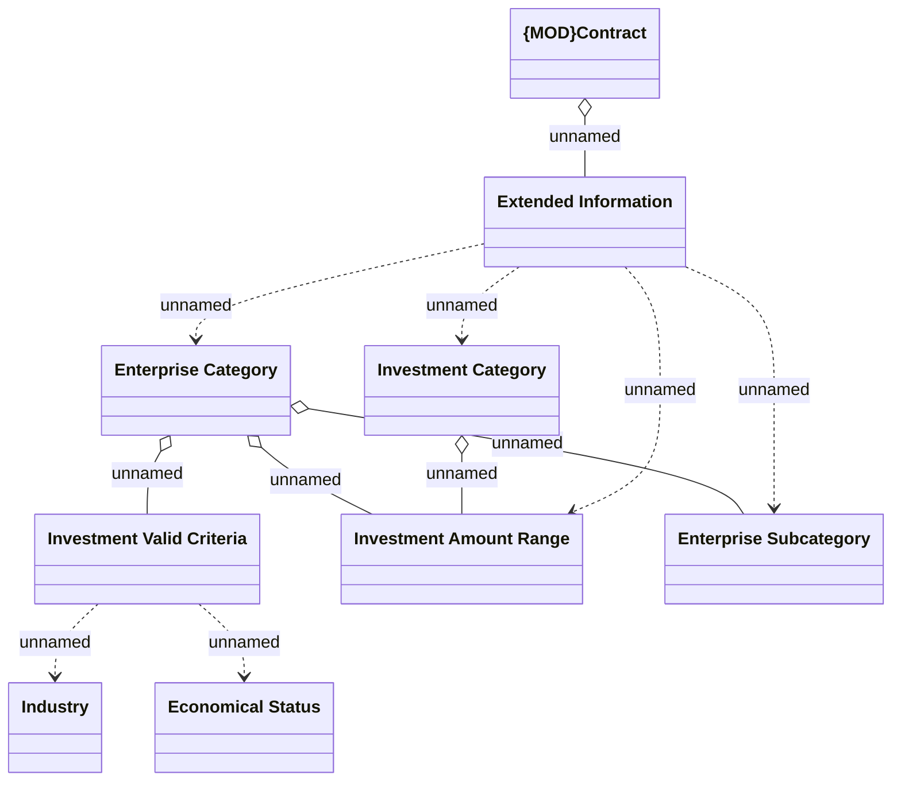

# Extended Information - Core

- **Diagram Type**: Logical
- **Package**: HomerSelect/BSL/Analysis Model/Contract Origination/Contract signing/Collect data before sign/Logical Data Model
- **Diagram ID**: 111685
- **Elements**: 9
- **Connectors**: 11

