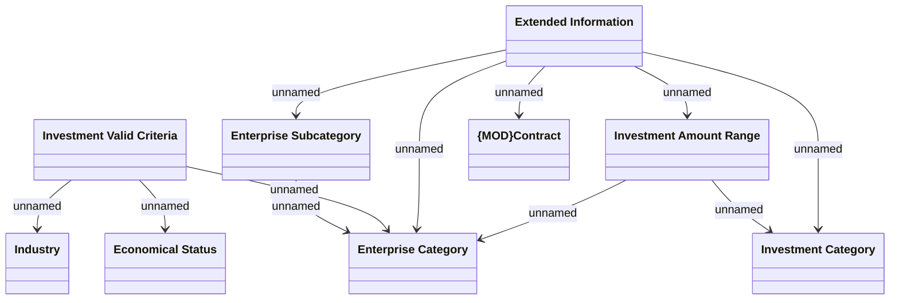

# Extended Information - Core

```mermaid
classDiagram
    class Extended_Information["Extended Information"]
    class Economical_Status["Economical Status"]
    class Industry["Industry"]
    class Investment_Valid_Criteria["Investment Valid Criteria"]
    class Investment_Amount_Range["Investment Amount Range"]
    class Investment_Category["Investment Category"]
    class Enterprise_Subcategory["Enterprise Subcategory"]
    class Enterprise_Category["Enterprise Category"]
    class MOD_Contract["{MOD}Contract"]
    Investment_Amount_Range --> Enterprise_Category : unnamed
    Extended_Information --> Enterprise_Category : unnamed
    Investment_Valid_Criteria --> Enterprise_Category : unnamed
    Enterprise_Subcategory --> Enterprise_Category : unnamed
    Extended_Information --> Enterprise_Subcategory : unnamed
    Extended_Information --> Investment_Category : unnamed
    Investment_Amount_Range --> Investment_Category : unnamed
    Extended_Information --> Investment_Amount_Range : unnamed
    Investment_Valid_Criteria --> Industry : unnamed
    Investment_Valid_Criteria --> Economical_Status : unnamed
    Extended_Information --> MOD_Contract : unnamed
```
