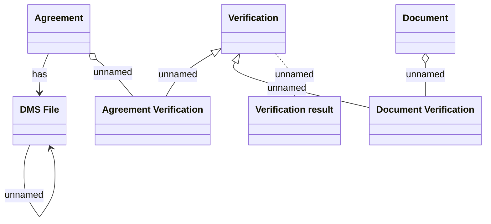

# Logical Data Model - Contract Signing

- **Diagram Type**: Logical
- **Package**: HomerSelect/BSL/Analysis Model/Contract Origination/Contract signing/Logical Data Model
- **Diagram ID**: 145855
- **Elements**: 7
- **Connectors**: 7

