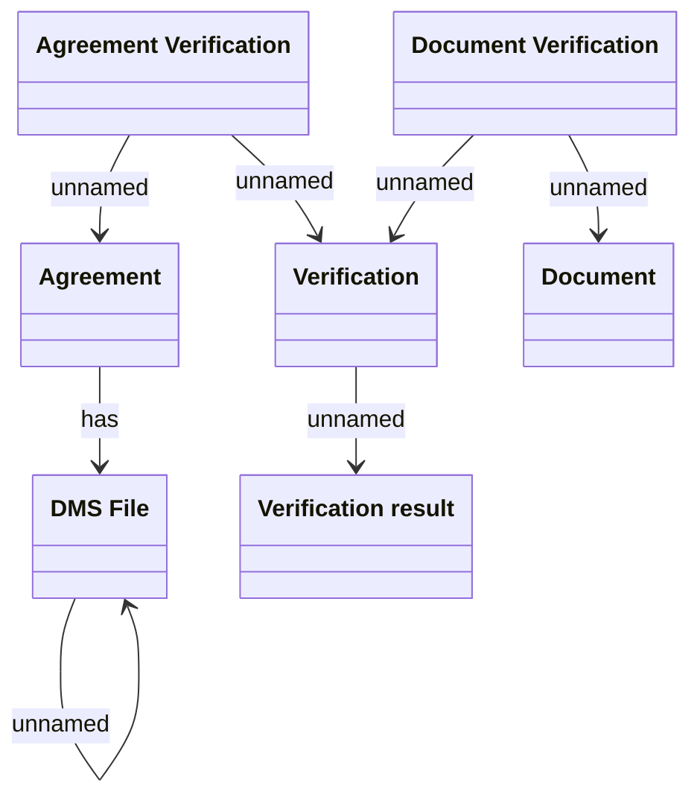

# Logical Data Model - Contract Signing

```mermaid
classDiagram
    class DMS_File["DMS File"]
    class Verification_result["Verification result"]
    class Agreement_Verification["Agreement Verification"]
    class Agreement["Agreement"]
    class Document_Verification["Document Verification"]
    class Verification["Verification"]
    class Document["Document"]
    Agreement_Verification --> Verification : unnamed
    Document_Verification --> Verification : unnamed
    DMS_File --> DMS_File : unnamed
    Agreement --> DMS_File : has
    Verification --> Verification_result : unnamed
    Document_Verification --> Document : unnamed
    Agreement_Verification --> Agreement : unnamed
```
